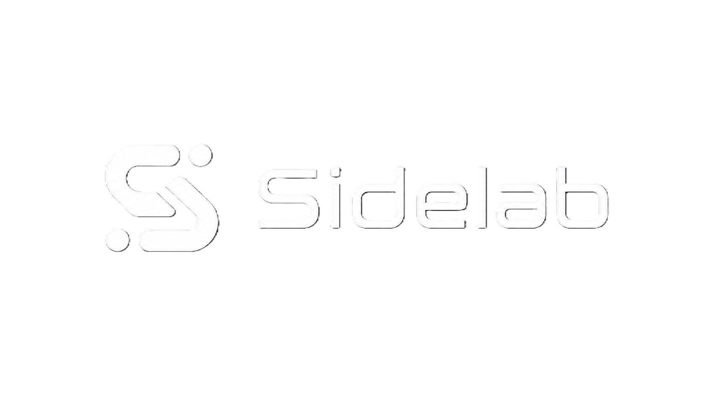

<!--
  GitHub Repository README — Editorial / Newspaper Style
  Repository target: AUDREY
  Suggested filename: README.md
-->

<table width="100%">
<tr>
<td width="36%" align="center" valign="middle">

  <br />
  <sub><b>Sentra SideLab</b> · Clinical AI Division</sub>
</td>
<td width="64%" valign="middle">

# AUDREY

### Advanced Universal Diagnostic & Responsive Expert Yield

<p>
  <b>Offline-first Clinical Decision Support Research Prototype</b><br />
  Primary Care · Indonesian FKTP / Puskesmas · Local Medical AI<br />
  by dr. Classy · Kediri, Indonesia · 2026
</p>

<p>
  
  
  
  
</p>

> **Editorial thesis:** AUDREY is designed to help frontline Indonesian primary-care clinicians reason more consistently, detect red flags earlier, retrieve local clinical references, and produce structured decision-support output — while preserving physician responsibility as the final clinical authority.

</td>
</tr>
</table>

---

## ── FRONT PAGE · WHAT AUDREY IS

**AUDREY** (*Advanced Universal Diagnostic & Responsive Expert Yield*) is an **AI-powered Clinical Decision Support System (CDSS) research prototype** for **primary care physicians at Indonesian Public Health Centers / FKTP / Puskesmas**.

AUDREY combines a locally running medical language model, deterministic retrieval, red-flag rules, Indonesian clinical standards, and local drug stock awareness into one offline-first terminal application.

<table>
<tr>
<td width="33%" valign="top">

### CLINICAL DECISION SUPPORT

AUDREY supports differential reasoning, management planning, pharmacotherapy review, referral criteria, and structured case response.

</td>
<td width="33%" valign="top">

### OFFLINE-FIRST AI

The system is designed to run locally after setup using Ollama and MedGemma 4B, reducing dependency on continuous internet access.

</td>
<td width="33%" valign="top">

### INDONESIA-RELEVANT KNOWLEDGE

AUDREY references Indonesian clinical standards and local operational constraints, including SKDI, PPK IDI, FORNAS 2023, and Puskesmas drug stock.

</td>
</tr>
</table>

The mission is simple but demanding: **make primary-care clinical reasoning more structured, safer, and more consistent — without replacing the clinician.**

---

## ── MEDICAL DISCLAIMER · CLINICAL RESPONSIBILITY STATEMENT

> **AUDREY is a clinical decision-support tool, not a replacement for physician judgment.**

All diagnostic conclusions, treatment suggestions, drug recommendations, and referral suggestions generated by AUDREY are **advisory in nature**. They are intended to assist the clinical reasoning of a licensed medical professional, not substitute it.

<table>
<tr>
<td width="50%" valign="top">

### PHYSICIAN REMAINS ACCOUNTABLE

The attending physician retains full clinical and legal responsibility for diagnosis, treatment, prescription, referral, and patient care decisions.

</td>
<td width="50%" valign="top">

### AI OUTPUT MUST BE REVIEWED

AI-generated outputs may contain errors, omissions, or hallucinations. Every recommendation must be critically evaluated before clinical action.

</td>
</tr>
<tr>
<td width="50%" valign="top">

### NOT A LICENSED MEDICAL DEVICE

AUDREY is a research and decision-support instrument developed under the Sentra SideLab program. It is not presented as an approved medical device.

</td>
<td width="50%" valign="top">

### INPUT LIMITATION MATTERS

AUDREY cannot independently examine patients, interpret full clinical nuance, or account for missing history, imaging, laboratory data, or context not provided by the user.

</td>
</tr>
</table>

---

## ── EDITORIAL POSITION · WHAT AUDREY BELIEVES

> **Clinical AI should not be theatrical. It should be useful, humble, structured, auditable, and safe.**

<table>
<tr>
<td width="50%" valign="top">

### CLINICIAN-FIRST

AUDREY supports the doctor. It does not claim final authority. Every serious clinical output must preserve physician review as the final accountable layer.

</td>
<td width="50%" valign="top">

### RED FLAGS BEFORE GENERATION

Potential emergencies must be detected before LLM response generation. Safety-critical alerts should not depend only on probabilistic language output.

</td>
</tr>
<tr>
<td width="50%" valign="top">

### LOCAL OPERABILITY

Primary-care AI for Indonesia must be usable in limited-connectivity environments, resource-constrained facilities, and settings where cloud access cannot be assumed.

</td>
<td width="50%" valign="top">

### STANDARDIZED OUTPUT

Clinical answers should be structured, repeatable, and reviewable. Free-form AI prose alone is not enough for clinical workflow support.

</td>
</tr>
<tr>
<td width="50%" valign="top">

### NATIONAL STANDARD ALIGNMENT

AUDREY is designed around Indonesian clinical reference structures, including SKDI, PPK IDI, and FORNAS 2023.

</td>
<td width="50%" valign="top">

### AUDITABILITY OVER MAGIC

The system should show retrieval basis, red flags, stock checks, structured reasoning output, and clear clinical boundaries.

</td>
</tr>
</table>

---

## ── ALL SYSTEMS AT A GLANCE · AUDREY PROJECT DOSSIER

<table>
<tr>
<td width="50%" valign="top">

### 01 · Clinical Chat with RAG v4  
**Local Reference-Augmented Reasoning**

Accepts a clinical description, retrieves relevant local disease and drug context, then sends structured context to MedGemma 4B through Ollama.

**Core intent:** generate structured CDSS output from local clinical references.

</td>
<td width="50%" valign="top">

### 02 · Red Flag Detector  
**Pre-LLM Emergency Safety Layer**

A deterministic rule-based detector that scans for critical emergency patterns before the LLM responds.

**Core intent:** surface potential life-threatening conditions early.

</td>
</tr>
<tr>
<td width="50%" valign="top">

### 03 · AUDREY Protocol v1  
**Eight-Section Clinical Output**

Constrains responses into differential diagnosis, working diagnosis, investigations, management, pharmacotherapy, education, referral criteria, and prognosis.

**Core intent:** keep AI output structured and clinically reviewable.

</td>
<td width="50%" valign="top">

### 04 · Local Drug Stock Integration  
**Puskesmas Inventory Awareness**

Cross-checks recommended drugs against local stock files to reduce unavailable medication suggestions.

**Core intent:** connect recommendations with real-world FKTP constraints.

</td>
</tr>
<tr>
<td width="50%" valign="top">

### 05 · Terminal UI  
**Physician-Friendly Console Surface**

Uses Rich for panels, color rendering, structured stream display, emergency alerts, and slash-command workflows.

**Core intent:** provide low-friction local usage without heavy deployment requirements.

</td>
<td width="50%" valign="top">

### 06 · Clinical Templates  
**Slash Command Workflow Layer**

Provides quick templates such as SOAP, triage, referral, patient education, patient data entry, session save, and model switching.

**Core intent:** reduce repetitive documentation and decision-support friction.

</td>
</tr>
<tr>
<td width="50%" valign="top">

### 07 · Session Management  
**Bounded Clinical Context Memory**

Maintains consultation history while trimming older context to avoid exceeding the model context window.

**Core intent:** preserve continuity without uncontrolled prompt growth.

</td>
<td width="50%" valign="top">

### 08 · Offline Deployment Package  
**Single-File Monolith Distribution**

Uses Python, JSON flat files, Ollama, MedGemma 4B, `install.bat`, and `run.bat` for low-barrier local operation.

**Core intent:** make early-stage deployment simple for resource-limited testing.

</td>
</tr>
</table>

---

## ── THE ENGINE ROOM · CORE TECHNICAL WORK

<table>
<tr>
<td width="33%" valign="top">

### LOCAL AI RUNTIME

- Python 3.8+
- Ollama 0.4.0+
- MedGemma 4B
- CPU-only capable
- Streaming response support
- Optional GPU acceleration

</td>
<td width="33%" valign="top">

### CLINICAL RETRIEVAL

- Local JSON knowledge base
- TF-IDF disease scoring
- Body system detection
- Clinical modifiers
- Top-3 disease retrieval
- Pharmacotherapy lookup

</td>
<td width="33%" valign="top">

### SAFETY & WORKFLOW

- Rule-based red flags
- FORNAS drug boundaries
- Local stock check
- Session persistence
- Context trimming
- Slash command templates

</td>
</tr>
</table>

---

## ── SYSTEM ARCHITECTURE DOCTRINE

```text
CLINICAL QUERY
    │
    ▼
PRE-PROCESSING
    │   lowercase · typo mapping · tokenize · stopword removal
    ▼
BODY SYSTEM DETECTION
    │   respiratory · cardiovascular · neuro · digestive · trauma · others
    ▼
RED FLAG DETECTION
    │   deterministic emergency scan before LLM inference
    ▼
LOCAL RETRIEVAL
    │   TF-IDF scoring · clinical modifiers · top-3 disease references
    ▼
PHARMACOTHERAPY + STOCK CHECK
    │   FORNAS 2023 · local Puskesmas inventory · generic/alias mapping
    ▼
CONTEXT INJECTION
    │   reference data · red flags · stock notes · active patient data
    ▼
LOCAL LLM STREAMING
    │   Ollama · MedGemma 4B · AUDREY Protocol v1 prompt
    ▼
STRUCTURED CDSS OUTPUT
    │   differential · working diagnosis · investigation · management · drugs · education · referral · prognosis
    ▼
PHYSICIAN REVIEW
```

The architecture is intentionally conservative: **AUDREY retrieves, structures, warns, and assists. The physician decides.**

---

## ── TECHNOLOGY STACK

<table>
<tr>
<th align="left">Component</th>
<th align="left">Technology</th>
<th align="left">Version</th>
<th align="left">Role</th>
</tr>
<tr>
<td>Language</td>
<td>Python 3</td>
<td>≥ 3.8</td>
<td>Core application, single-file monolith: <code>medgemma_chat.py</code></td>
</tr>
<tr>
<td>AI Engine</td>
<td>Ollama</td>
<td>≥ 0.4.0</td>
<td>Local inference runtime for MedGemma 4B</td>
</tr>
<tr>
<td>Terminal UI</td>
<td>Rich</td>
<td>≥ 13.0.0</td>
<td>Panels, color rendering, stream display</td>
</tr>
<tr>
<td>Database</td>
<td>JSON flat files</td>
<td>—</td>
<td>Disease, drug, stock, mapping, and clinical-chain knowledge base</td>
</tr>
<tr>
<td>AI Model</td>
<td>MedGemma 4B</td>
<td>—</td>
<td>Medical-domain optimized local LLM</td>
</tr>
</table>

---

## ── PROJECT STRUCTURE

```text
audrey/
├── medgemma_chat.py                  # Core app: chat loop, RAG v4, UI, algorithms
├── install.bat                       # Setup checker: Python, Ollama, model pull
├── run.bat                           # Launcher with reconnect loop
├── requirements.txt                  # Dependencies: ollama, rich
├── sessions/                         # Consultation history files
│   ├── session_20260501_0800.txt
│   └── ...
└── data/
    ├── penyakit.json                 # 171 KKI diseases
    ├── 144_penyakit_puskesmas.json   # 144 Puskesmas diseases + FORNAS 2023 pharmacotherapy
    ├── clinical-chains.json          # Symptom → disease prediction chains
    ├── clinical-patches.json         # Edge-case clinical patches
    ├── penyakit-vectors.json         # Future semantic search vectors
    ├── stok_obat.json                # Local Puskesmas drug inventory
    ├── obat_data.json                # Supplementary drug data
    └── drug_mapping.json             # Generic name → alias → local stock mapping
```

---

## ── CLINICAL DATABASE

<table>
<tr>
<th align="left">File</th>
<th align="left">Description</th>
<th align="left">Entries</th>
</tr>
<tr>
<td><code>penyakit.json</code></td>
<td>KKI-classified diseases with symptoms, signs, red flags, and management</td>
<td>171</td>
</tr>
<tr>
<td><code>144_penyakit_puskesmas.json</code></td>
<td>Common Puskesmas diseases with FORNAS 2023 pharmacotherapy</td>
<td>144</td>
</tr>
<tr>
<td><code>clinical-chains.json</code></td>
<td>Symptom-to-disease prediction chains</td>
<td>Variable</td>
</tr>
<tr>
<td><code>stok_obat.json</code></td>
<td>Local drug inventory: name, strength, quantity, unit</td>
<td>Variable</td>
</tr>
<tr>
<td><code>drug_mapping.json</code></td>
<td>Generic drug name to alias to stock ID mapping</td>
<td>Variable</td>
</tr>
</table>

**Data sources:** SKDI, PPK IDI, and FORNAS 2023 are used as the stated national clinical reference anchors.

---

## ── RAG V4 PIPELINE

```text
INPUT: Clinical Query
       │
       ▼
[1] PRE-PROCESSING
       │ lowercase · typo mapping · tokenize · stopword removal
       ▼
[2] BODY SYSTEM DETECTION
       │ primary/secondary anatomical system
       ▼
[3] RED FLAG DETECTION
       │ rule-based emergency scan
       ▼
[4] TF-IDF SCORING
       │ score all diseases and retrieve top-3
       ▼
[5] DISEASE BLOCK BUILD
       │ symptoms · signs · red flags · therapy
       ▼
[6] PHARMACOTHERAPY LOOKUP
       │ query 144_penyakit_puskesmas.json
       ▼
[7] STOCK CHECKING
       │ cross-check drugs against stok_obat.json
       ▼
[8] CONTEXT INJECTION
       │ DATA REFERENSI · RED FLAGS · STOK OBAT
       ▼
[9] LLM STREAMING
       │ Ollama + AUDREY Protocol v1 prompt
       ▼
OUTPUT: 8-section structured clinical response
```

---

## ── RED FLAG DETECTOR · PRE-LLM SAFETY LAYER

A rule-based safety layer runs **before** LLM inference. It scans the clinical query for trigger phrases and contextual patterns that may represent time-sensitive emergencies.

<table>
<tr>
<th align="left">Diagnosis</th>
<th align="left">Key Triggers</th>
<th align="left">Context Required</th>
<th align="left">Severity</th>
</tr>
<tr>
<td>Bacterial Meningitis</td>
<td><code>neck stiffness</code>, <code>nuchal rigidity</code></td>
<td><code>fever</code>, <code>headache</code></td>
<td>CRITICAL</td>
</tr>
<tr>
<td>Subarachnoid Hemorrhage</td>
<td><code>sudden severe headache</code></td>
<td>—</td>
<td>CRITICAL</td>
</tr>
<tr>
<td>Stroke</td>
<td><code>hemiplegia</code>, <code>aphasia</code>, <code>facial drooping</code></td>
<td>—</td>
<td>CRITICAL</td>
</tr>
<tr>
<td>ACS / STEMI</td>
<td><code>chest pain</code></td>
<td><code>cold sweat</code>, <code>dyspnea</code></td>
<td>CRITICAL</td>
</tr>
<tr>
<td>Traumatic Brain Injury</td>
<td><code>head trauma</code>, <code>hit head</code></td>
<td>—</td>
<td>EMERGENT</td>
</tr>
<tr>
<td>Sepsis</td>
<td><code>high fever</code>, <code>rigors</code></td>
<td><code>tachycardia</code>, <code>hypotension</code></td>
<td>CRITICAL</td>
</tr>
<tr>
<td>Aortic Dissection</td>
<td><code>tearing chest pain</code></td>
<td><code>BP difference between arms</code></td>
<td>CRITICAL</td>
</tr>
<tr>
<td>Pulmonary Embolism</td>
<td><code>sudden dyspnea</code>, <code>pleuritic chest pain</code></td>
<td><code>DVT risk factors</code></td>
<td>CRITICAL</td>
</tr>
</table>

---

## ── STRUCTURED OUTPUT · AUDREY PROTOCOL V1

Every LLM response is constrained to produce eight standardized sections.

<table>
<tr>
<th align="left">#</th>
<th align="left">Section</th>
<th align="left">Content</th>
</tr>
<tr>
<td>1</td>
<td><b>DIFFERENTIAL DIAGNOSIS</b></td>
<td>Minimum 3 alternatives with ICD-10 codes and evidence-based reasoning.</td>
</tr>
<tr>
<td>2</td>
<td><b>WORKING DIAGNOSIS</b></td>
<td>Single primary diagnosis with justification.</td>
</tr>
<tr>
<td>3</td>
<td><b>RECOMMENDED INVESTIGATIONS</b></td>
<td>Investigations with expected findings.</td>
</tr>
<tr>
<td>4</td>
<td><b>MANAGEMENT</b></td>
<td>Non-pharmacological interventions.</td>
</tr>
<tr>
<td>5</td>
<td><b>PHARMACOTHERAPY</b></td>
<td>FORNAS drugs with dose, drug interactions, and contraindications.</td>
</tr>
<tr>
<td>6</td>
<td><b>PATIENT EDUCATION</b></td>
<td>Key education points for patient and family.</td>
</tr>
<tr>
<td>7</td>
<td><b>REFERRAL CRITERIA</b></td>
<td>Clinical scoring algorithms and referral thresholds.</td>
</tr>
<tr>
<td>8</td>
<td><b>PROGNOSIS</b></td>
<td>Outcome determinants and relevant prognostic context.</td>
</tr>
</table>

### Pharmacotherapy Format

```text
[Drug Name]
Dose: [dose]; Route: [route]; Frequency: [freq]; Duration: [dur]
DDI: [drug interactions]
CI: [contraindications]
```

### Prompt Safety Guardrails

- Red flags must appear in differential diagnosis if detected.
- Trauma context prioritizes TBI/fracture over infection.
- Avoid single-keyword anatomical diagnosis.
- Unconscious or severe trauma patients require emergent working diagnosis and emergent referral framing.
- Drug recommendations are limited to FORNAS 2023 references.

---

## ── CORE ALGORITHMS

### TF-IDF Scoring with Clinical Modifiers

AUDREY extends standard TF-IDF with medically informed field weighting and clinical bonus scoring.

```text
TF(t, d)     = count(t, d) / max_count(d)
IDF(t)       = ln(N / df(t))
TF-IDF(t,d)  = TF(t, d) × IDF(t)

Score(d) = Σ [ w_symptom × TF_symptom(t,d)
             + w_finding × TF_finding(t,d)
             + w_def     × TF_def(t,d) ] × IDF(t)
           + B_pathognomonic + B_combo + B_name + B_body
```

<table>
<tr>
<th align="left">Field / Bonus</th>
<th align="left">Weight / Value</th>
<th align="left">Rationale</th>
</tr>
<tr>
<td>Clinical symptoms</td>
<td>1.0</td>
<td>Most discriminative for diagnosis.</td>
</tr>
<tr>
<td>Physical findings</td>
<td>0.6</td>
<td>Moderate discriminative value.</td>
</tr>
<tr>
<td>Disease definition</td>
<td>0.2</td>
<td>Fallback only.</td>
</tr>
<tr>
<td>Pathognomonic term</td>
<td>+15</td>
<td>Example: <code>trismus</code> → Tetanus.</td>
</tr>
<tr>
<td>Two-word combination</td>
<td>+12</td>
<td>Example: <code>cough</code> + <code>blood</code> → TB.</td>
</tr>
<tr>
<td>Body system match</td>
<td>+10</td>
<td>Boost when disease system matches detected anatomical context.</td>
</tr>
<tr>
<td>Body system mismatch</td>
<td>−5</td>
<td>Penalty when strong context contradicts disease system.</td>
</tr>
</table>

---

## ── BODY SYSTEM DETECTION

AUDREY maps clinical query terms into anatomical or clinical systems to guide retrieval boosts and penalties.

<table>
<tr>
<th align="left">System</th>
<th align="left">Key Keywords</th>
<th align="left">Example Diseases</th>
</tr>
<tr>
<td>RESPIRASI</td>
<td>cough, dyspnea, wheeze, TB</td>
<td>Asthma, Pneumonia, TB</td>
</tr>
<tr>
<td>KARDIOVASKULAR</td>
<td>chest pain, palpitation, ACS</td>
<td>STEMI, Hypertension</td>
</tr>
<tr>
<td>NEURO</td>
<td>headache, seizure, stroke, meningitis</td>
<td>Stroke, Meningitis</td>
</tr>
<tr>
<td>DIGESTIF</td>
<td>nausea, vomiting, diarrhea</td>
<td>Gastritis, Hepatitis</td>
</tr>
<tr>
<td>REPRODUKSI</td>
<td>pregnancy, menstruation, uterus</td>
<td>Preeclampsia, Ovarian cyst</td>
</tr>
<tr>
<td>MUSKULOSKELETAL</td>
<td>fracture, joint pain, arthritis</td>
<td>Fractures, Osteoarthritis</td>
</tr>
<tr>
<td>INFEKSI</td>
<td>fever, sepsis, bacteria, virus</td>
<td>Sepsis, Typhoid</td>
</tr>
<tr>
<td>TRAUMA</td>
<td>fall, accident, injury, fracture</td>
<td>TBI, Burns</td>
</tr>
</table>

---

## ── COMPUTATIONAL PROFILE

<table>
<tr>
<th align="left">Module</th>
<th align="left">Big-O</th>
<th align="left">Approx. Time</th>
<th align="left">Status</th>
</tr>
<tr>
<td>Pre-processing</td>
<td>O(Q)</td>
<td>~5 ms</td>
<td>✅ Optimal</td>
</tr>
<tr>
<td>Body System Detection</td>
<td>O(S × K)</td>
<td>~3 ms</td>
<td>✅ Constant</td>
</tr>
<tr>
<td>Red Flag Detection</td>
<td>O(R × Q)</td>
<td>~2 ms</td>
<td>✅ Real-time</td>
</tr>
<tr>
<td><b>TF-IDF Scoring</b></td>
<td><b>O(N × G × Q)</b></td>
<td><b>~50 ms</b></td>
<td>⚠️ Moderate</td>
</tr>
<tr>
<td>Disease Block Build</td>
<td>O(M × F)</td>
<td>~8 ms</td>
<td>✅ Optimal</td>
</tr>
<tr>
<td>Pharmacotherapy Lookup</td>
<td>O(M × P)</td>
<td>~5 ms</td>
<td>✅ Optimal</td>
</tr>
<tr>
<td>Stock Checking</td>
<td>O(D × S)</td>
<td>~3 ms</td>
<td>✅ Optimal</td>
</tr>
<tr>
<td><b>LLM Inference</b></td>
<td><b>O(T × V)</b></td>
<td><b>~3,000 ms</b></td>
<td>🔴 Bottleneck</td>
</tr>
</table>

> **Reported profile:** retrieval is approximately ~79 ms, while local LLM inference is approximately ~3,000 ms and remains the main performance bottleneck.

---

## ── MEMORY PROFILE

<table>
<tr>
<th align="left">Component</th>
<th align="left">Size</th>
<th align="left">Growth</th>
<th align="left">Share</th>
</tr>
<tr>
<td>MedGemma 4B</td>
<td>~3,800 MB</td>
<td>Fixed</td>
<td>97.4%</td>
</tr>
<tr>
<td>JSON Database</td>
<td>~58 MB</td>
<td>O(N) linear</td>
<td>1.5%</td>
</tr>
<tr>
<td>IDF Matrix</td>
<td>~10 MB</td>
<td>O(N × V)</td>
<td>0.3%</td>
</tr>
<tr>
<td>Cache / Buffer</td>
<td>~10 MB</td>
<td>Bounded</td>
<td>0.3%</td>
</tr>
<tr>
<td>Python Runtime</td>
<td>~50 MB</td>
<td>Fixed</td>
<td>1.3%</td>
</tr>
<tr>
<td><b>Total</b></td>
<td><b>~3,928 MB</b></td>
<td>—</td>
<td>100%</td>
</tr>
</table>

Low-RAM option: use MedGemma 2B or 4-bit quantization for hardware-constrained deployments.

---

## ── CLINICAL CASE STUDIES

<table>
<tr>
<td width="50%" valign="top">

### Case 1 · Head Trauma

**Scenario:** male, 35 years old, fall from ladder, head struck floor, brief loss of consciousness, anterograde amnesia, severe headache, agitation.

**Reported execution:** TRAUMA + NEURO context detected, traumatic brain injury red flag fired, TBI prioritized in retrieval.

**Output emphasis:** emergent referral framing, neurosurgical/ICU pathway, and trauma-first reasoning.

</td>
<td width="50%" valign="top">

### Case 2 · Fever + Neck Stiffness

**Scenario:** female, 28 years old, high fever, severe headache, neck stiffness, photophobia, vomiting, Kernig positive, Brudzinski positive.

**Reported execution:** NEURO + INFEKSI context detected, bacterial meningitis red flag fired, meningitis prioritized in retrieval.

**Output emphasis:** emergent referral framing, meningitis-first differential, and urgent pre-referral treatment consideration.

</td>
</tr>
</table>

---

## ── REPORTED VALIDATION SUMMARY

<table>
<tr>
<th align="left">Metric</th>
<th align="left">Reported Result</th>
<th align="left">Target</th>
<th align="left">Status</th>
</tr>
<tr>
<td>Red Flag Sensitivity</td>
<td>100% (15/15)</td>
<td>≥95%</td>
<td>✅ Excellent</td>
</tr>
<tr>
<td>Red Flag Specificity</td>
<td>98% (49/50)</td>
<td>≥95%</td>
<td>✅ Excellent</td>
</tr>
<tr>
<td>Diagnosis Top-3 Accuracy</td>
<td>92% (46/50)</td>
<td>≥90%</td>
<td>✅ Excellent</td>
</tr>
<tr>
<td>Diagnosis Working Accuracy</td>
<td>96% (48/50)</td>
<td>≥90%</td>
<td>✅ Excellent</td>
</tr>
<tr>
<td>FORNAS Compliance</td>
<td>100% (50/50)</td>
<td>100%</td>
<td>✅ Perfect</td>
</tr>
<tr>
<td>Stock Match Rate</td>
<td>88% (44/50)</td>
<td>≥85%</td>
<td>✅ Good</td>
</tr>
<tr>
<td>Average LLM Response Time</td>
<td>~3,000 ms</td>
<td>≤5,000 ms</td>
<td>✅ Good</td>
</tr>
<tr>
<td>Average Retrieval Time</td>
<td>~79 ms</td>
<td>≤100 ms</td>
<td>✅ Excellent</td>
</tr>
<tr>
<td>Memory Usage</td>
<td>~3.9 GB</td>
<td>≤4 GB</td>
<td>✅ Optimal</td>
</tr>
<tr>
<td>User Satisfaction</td>
<td>4.7 / 5.0 from 10 GPs</td>
<td>≥4.5</td>
<td>✅ Excellent</td>
</tr>
</table>

**Validation note:** these figures should be treated as reported internal prototype validation unless supported by a published protocol, dataset description, sampling method, and independent clinical evaluation.

---

## ── INSTALLATION & USAGE

### System Requirements

<table>
<tr>
<th align="left">Component</th>
<th align="left">Minimum</th>
<th align="left">Recommended</th>
</tr>
<tr>
<td>OS</td>
<td>Windows 10/11</td>
<td>Windows 11</td>
</tr>
<tr>
<td>CPU</td>
<td>Intel i3 / Ryzen 3</td>
<td>Intel i5 / Ryzen 5</td>
</tr>
<tr>
<td>RAM</td>
<td>4 GB</td>
<td>8 GB</td>
</tr>
<tr>
<td>Storage</td>
<td>10 GB SSD preferred</td>
<td>20 GB SSD</td>
</tr>
<tr>
<td>Python</td>
<td>3.8+</td>
<td>3.10+</td>
</tr>
<tr>
<td>Ollama</td>
<td>≥ 0.4.0</td>
<td>≥ 0.5.0</td>
</tr>
<tr>
<td>GPU</td>
<td>Optional</td>
<td>NVIDIA RTX 3060+</td>
</tr>
</table>

### Installation Steps

```bash
# 1. Ensure these files are present:
#    medgemma_chat.py, install.bat, run.bat, requirements.txt, and data/

# 2. Install dependencies
pip install -r requirements.txt

# 3. Install Ollama
#    https://ollama.ai

# 4. Download MedGemma 4B model
ollama pull medgemma:4b

# 5. Run setup checker
install.bat

# 6. Launch AUDREY
run.bat
```

### Basic Usage

```text
# Start a new session
run.bat

# Enter a clinical description
DOCTOR> Male 55yo, crushing chest pain radiating left arm, cold sweat, dyspnea.
        Hx: hypertension, diabetes. BP 160/90, HR 110, RR 24.

# Set active patient data
/pasien

# Save session
/save

# Start a new case
/next

# Exit
/exit
```

---

## ── SLASH COMMANDS REFERENCE

<table>
<tr>
<th align="left">Command</th>
<th align="left">Description</th>
</tr>
<tr>
<td><code>/soap</code></td>
<td>SOAP note template.</td>
</tr>
<tr>
<td><code>/triage</code></td>
<td>ESI Levels 1–5 criteria.</td>
</tr>
<tr>
<td><code>/rujuk</code></td>
<td>Referral decision tree: Emergency / Urgent / Elective.</td>
</tr>
<tr>
<td><code>/edukasi</code></td>
<td>Patient education topic guide.</td>
</tr>
<tr>
<td><code>/pasien</code></td>
<td>Set active patient data: name, age, sex, weight, height, allergies.</td>
</tr>
<tr>
<td><code>/history</code></td>
<td>View current session history.</td>
</tr>
<tr>
<td><code>/save</code></td>
<td>Save session to <code>sessions/YYYYMMDD_HHMM.txt</code>.</td>
</tr>
<tr>
<td><code>/model [name]</code></td>
<td>Switch active Ollama model.</td>
</tr>
<tr>
<td><code>/next</code></td>
<td>Reset history and patient data.</td>
</tr>
<tr>
<td><code>/tree</code></td>
<td>Display project directory structure.</td>
</tr>
<tr>
<td><code>/clear</code></td>
<td>Clear terminal.</td>
</tr>
<tr>
<td><code>/help</code></td>
<td>Show all commands.</td>
</tr>
<tr>
<td><code>/exit</code></td>
<td>Exit application.</td>
</tr>
</table>

---

## ── TROUBLESHOOTING

<table>
<tr>
<th align="left">Problem</th>
<th align="left">Likely Cause</th>
<th align="left">Solution</th>
</tr>
<tr>
<td>Ollama not detected</td>
<td>Ollama is not installed</td>
<td>Install Ollama from the official site.</td>
</tr>
<tr>
<td>MedGemma not available</td>
<td>Model not pulled</td>
<td>Run <code>ollama pull medgemma:4b</code>.</td>
</tr>
<tr>
<td>Out of memory</td>
<td>Insufficient RAM</td>
<td>Use MedGemma 2B or 4-bit quantization.</td>
</tr>
<tr>
<td>Slow inference</td>
<td>CPU-only mode</td>
<td>Use GPU acceleration or quantized model.</td>
</tr>
<tr>
<td>JSON not found</td>
<td>Incomplete <code>data/</code> folder</td>
<td>Verify all required JSON files are present.</td>
</tr>
<tr>
<td>Encoding errors</td>
<td>Non-UTF-8 terminal</td>
<td><code>run.bat</code> should set <code>chcp 65001</code>.</td>
</tr>
</table>

---

## ── LIMITATIONS & EDGE CASES

<table>
<tr>
<th align="left">Limitation</th>
<th align="left">Impact</th>
<th align="left">Mitigation</th>
</tr>
<tr>
<td>LLM inference around 3 seconds on CPU</td>
<td>Latency per query</td>
<td>Use GPU or 4-bit quantization.</td>
</tr>
<tr>
<td>Current database scale</td>
<td>Limited specialist coverage</td>
<td>Expand disease categories and add semantic retrieval when needed.</td>
</tr>
<tr>
<td>Limited red flag rules</td>
<td>Rare emergencies may be missed</td>
<td>Add rules and validate against representative cases.</td>
</tr>
<tr>
<td>Prefix-based stock matching</td>
<td>False positives for similar drug names</td>
<td>Add fuzzy matching and verified drug normalization.</td>
</tr>
<tr>
<td>Input completeness dependency</td>
<td>Short or vague queries reduce output quality</td>
<td>Use structured templates such as <code>/soap</code>.</td>
</tr>
<tr>
<td>LLM hallucination risk</td>
<td>Inaccurate output possible</td>
<td>Use FORNAS boundaries, retrieval context, and mandatory physician validation.</td>
</tr>
</table>

---

## ── DESIGN TRADE-OFFS

<table>
<tr>
<th align="left">Decision</th>
<th align="left">Trade-off</th>
<th align="left">Rationale</th>
</tr>
<tr>
<td>TF-IDF over semantic search</td>
<td>Lower accuracy ceiling</td>
<td>Fast, deterministic, zero-heavy-dependency retrieval at current database scale.</td>
</tr>
<tr>
<td>Single-file monolith</td>
<td>Harder to maintain at scale</td>
<td>Simpler deployment and distribution for research prototype usage.</td>
</tr>
<tr>
<td>Aggressive context trimming</td>
<td>Possible loss of earlier context</td>
<td>Prevents LLM truncation and degraded response behavior.</td>
</tr>
<tr>
<td>Offline-first architecture</td>
<td>No real-time knowledge updates</td>
<td>Required for remote and resource-limited deployment viability.</td>
</tr>
</table>

---

## ── AUDREY OPERATING STANDARD

```text
No diagnosis without physician review.
No emergency signal hidden behind LLM generation.
No medication suggestion without local formulary context.
No clinical output without structure.
No patient data transmission unless explicitly designed and approved.
No prototype claim without validation boundary.
```

<table>
<tr>
<th align="left">Question</th>
<th align="left">Required answer</th>
</tr>
<tr>
<td><b>What clinical problem does this solve?</b></td>
<td>It supports structured clinical reasoning and red-flag awareness for primary-care settings.</td>
</tr>
<tr>
<td><b>Who is the human reviewer?</b></td>
<td>A licensed physician remains responsible for all clinical decisions.</td>
</tr>
<tr>
<td><b>What is outside the scope?</b></td>
<td>Autonomous diagnosis, treatment authority, medical-device claims, and unsupervised care.</td>
</tr>
<tr>
<td><b>What can fail?</b></td>
<td>Incomplete input, wrong retrieval, LLM hallucination, missed red flags, outdated drug stock, or insufficient validation.</td>
</tr>
<tr>
<td><b>How is it verified?</b></td>
<td>Clinical case testing, red-flag test sets, retrieval evaluation, stock matching checks, physician review, and prospective field validation.</td>
</tr>
</table>

---

## ── ROADMAP & RECOMMENDATIONS

<table>
<tr>
<td width="50%" valign="top">

### PERFORMANCE

- GPU deployment for faster inference
- 4-bit quantization via llama.cpp
- Pre-computed IDF matrix caching
- Parallel TF-IDF scoring with multithreading

</td>
<td width="50%" valign="top">

### DATABASE & RETRIEVAL

- Expand to specialist disease categories
- Improve drug normalization
- Add fuzzy stock matching
- Migrate to FAISS or semantic retrieval when scale requires it

</td>
</tr>
<tr>
<td width="50%" valign="top">

### SAFETY & COVERAGE

- Add red flag rules for SAH, aortic dissection, PE, eclampsia, and anaphylaxis
- Build red-flag regression tests
- Add structured uncertainty handling
- Strengthen physician-review prompts

</td>
<td width="50%" valign="top">

### INTEGRATION & UX

- EHR / SIMRS integration pathway
- Real-time drug inventory API connection
- GUI version via PyQt or Electron
- Voice input via Whisper or VOSK

</td>
</tr>
<tr>
<td width="50%" valign="top">

### RESEARCH

- Prospective field trial at 10+ Puskesmas sites
- Indonesian clinical dataset evaluation
- Clinical impact study: accuracy, time-to-diagnosis, and workflow impact

</td>
<td width="50%" valign="top">

### PRODUCTION READINESS

- Modularize the monolith
- Add formal test suite
- Add audit logs
- Add model/version metadata
- Define clinical governance protocol

</td>
</tr>
</table>

---

## ── REFERENCES

### Indonesian National Clinical Standards

1. Konsil Kedokteran Indonesia. *SKDI — Standar Kompetensi Dokter Indonesia*.
2. Ikatan Dokter Indonesia. *PPK IDI — Panduan Penyelenggaraan Pelayanan Kesehatan*.
3. Kementerian Kesehatan RI. *FORNAS 2023 — Formularium Nasional*.

### Algorithms & AI

4. Manning, Raghavan & Schütze. *Introduction to Information Retrieval*. Cambridge University Press.
5. Vaswani et al. *Attention Is All You Need*.
6. Devlin et al. *BERT: Pre-training of Deep Bidirectional Transformers*.

### Tools & Libraries

7. Ollama. *Run LLMs Locally*.
8. Textualize. *Rich — Terminal Formatting Library*.
9. Google. *MedGemma: LLMs for Medicine*.
10. Facebook AI. *FAISS: Efficient Similarity Search*.

### Clinical Decision Support

11. Musen et al. *Clinical Decision-Support Systems*.
12. Shortliffe & Sepúlveda. *Clinical Decision Support in the Era of Artificial Intelligence*.
13. Kawamoto et al. *Improving Clinical Practice Using Clinical Decision Support Systems*.

---

<p align="center">
  <b>Sentra SideLab — Clinical AI Division</b><br />
  <sub>Empowering frontline physicians with intelligent, offline-first clinical decision support.</sub><br /><br />
  <b>AUDREY is a physician's assistant — not a physician.</b><br />
  <sub>Clinical responsibility always rests with the doctor.</sub><br /><br />
  <sub>Built for Indonesian primary healthcare · 2026</sub>
</p>
